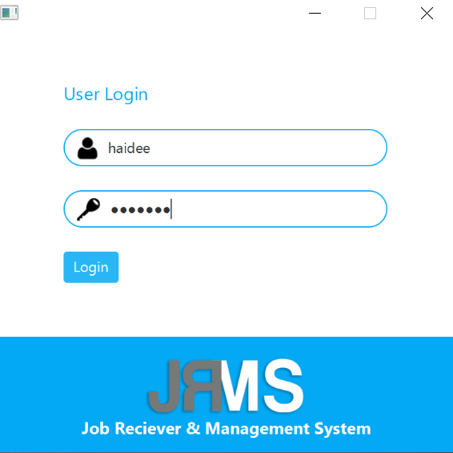
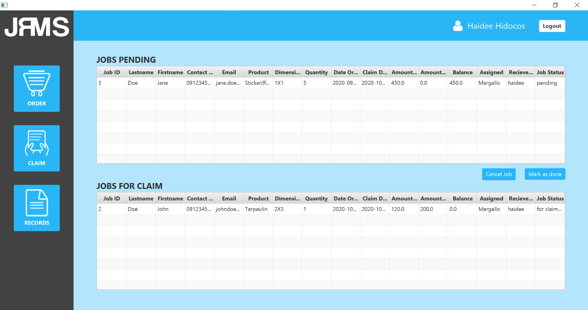
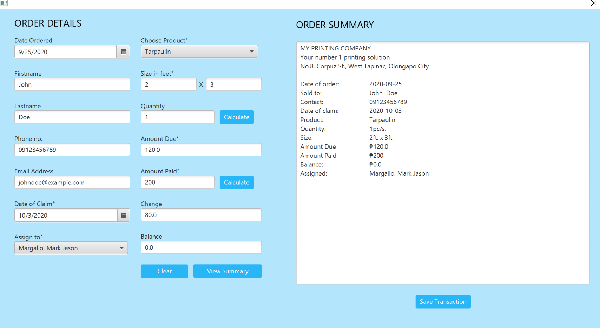

# JRMS

### Job Receiving and Management System

The Job Receiver and Management System (JRMS) is a system designed for large format
printing companies.

### Features:
* Assign job orders to employees
* Track jobs and see their status
* Search, view and edit employee records as well as product records

### Setup:
* Copy the contents of the `databaseFiles` folder in `C:\xampp\mysql\data`
* Make sure to start mysql in your xampp control panel to be able to use the system.